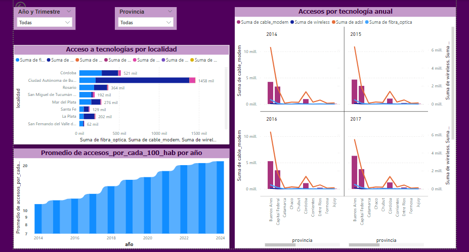

# <h1 align = 'center'>  Proyecto_2_Telecomunicaciones </h1>
Data Analyst.

    

## Introducción:
---
En Argentina, las telecomunicaciones son fundamentales para la transmisión de información a través de medios como la telefonía, televisión, radio e internet. El internet, en particular, ha transformado significativamente la vida cotidiana, cambiando la forma en que los argentinos se comunican, trabajan y se entretienen. La industria de telecomunicaciones del país ha mostrado un fuerte desarrollo, situándose a la vanguardia en la región. Para el año 2020, Argentina contaba con 62,12 millones de conexiones, reflejando su avance y liderazgo en el sector.

## Contexto
---
En este contexto, una empresa prestadora de servicios de telecomunicaciones le encarga a usted la realización de un análisis completo que permita reconocer el comportamiento de este sector a nivel nacional. Considere que la principal actividad de la empresa es brindar acceso a internet , pero también es importante considerar el comportamiento asociado al resto de los servicios de comunicación, con el fin de orientar a la empresa en brindar una buena calidad de sus servicios, identificar oportunidades de crecimiento y poder plantear soluciones personalizadas a sus posibles clientes.

## ETL
---
Realizamos un proceso de Extracción, Transformación y Carga (ETL) a una base de datos de telecomunicaciones en Argentina con el objetivo de limpiar, organizar y preparar los datos para su análisis.

Extracción: En esta etapa, recopilamos datos de diversas fuentes, como registros de accesos a internet por tecnología, velocidades de conexión, penetración en hogares y población, y otras métricas clave relacionadas con la conectividad en Argentina. Estos datos se encontraban en diferentes formatos y estructuras, por lo que fue necesario unificar y estandarizar la información para su posterior procesamiento.

Transformación: Una vez extraídos los datos, procedimos a realizar varias transformaciones para asegurar su consistencia y utilidad. Esto incluyó la limpieza de datos, como la eliminación de duplicados y la corrección de valores erróneos, así como la normalización de las columnas, que implicó convertir formatos de texto a numéricos y viceversa, además de manejar diferentes tipos de separadores decimales.

Carga: Finalmente, cargamos los datos transformados en un sistema de almacenamiento adecuado para su análisis posterior. Esta base de datos ahora está organizada de manera que permite una exploración eficiente de las conexiones a internet en Argentina, facilitando el análisis de la penetración del servicio por provincia, la comparación de tecnologías, la velocidad de acceso y otros aspectos críticos de las telecomunicaciones en el país.

Este proceso ETL nos proporcionó un conjunto de datos coherente y listo para ser utilizado en análisis avanzados, ayudando a entender mejor el estado actual de las telecomunicaciones en Argentina y a identificar oportunidades de mejora en el sector.
**ETL**

## EDA
---
Realizamos un Análisis Exploratorio de Datos (EDA) sobre la base de datos de telecomunicaciones de Argentina. Identificamos outliers, analizamos la distribución de accesos a internet por tecnología y velocidad, y visualizamos la penetración del servicio en diferentes provincias. Este análisis inicial nos ayudó a comprender las principales tendencias y variabilidades en el acceso a internet en el país, estableciendo una base sólida para análisis más detallados.
**EDA_TC**

## Tecnologías
---

&nbsp;

## Datos 
---
* Los datos que se usaron en este proyecto fueron obtenidos de la página Ente Nacional de Comunicaciones (ENACOM) de Argentina. [Datos originales](https://indicadores.enacom.gob.ar/datos-abiertos)

## KPIs
---
1. **KPI: Aumento del 2% en el Acceso a Internet por Hogares**

* Objetivo: Incrementar en un 2% el acceso al servicio de internet en cada provincia para el próximo trimestre, medido por cada 100 hogares.

* Descripción: Este KPI se enfoca en evaluar y fomentar el crecimiento en la penetración del servicio de internet en Argentina a nivel provincial. Para cada 100 hogares, se espera un aumento del 2% en el número de accesos a internet con respecto al trimestre anterior. Este incremento es fundamental para mejorar la conectividad y reducir la brecha digital en diferentes regiones del país.

2. **KPI 2: Velocidad Media de Conexión por Provincia**

* Objetivo: mide la velocidad media de conexión a Internet en cada provincia, proporcionando una visión general de la calidad del servicio en diferentes áreas.

* Importancia: La velocidad de conexión es un indicador crítico de la calidad de vida digital y del potencial de desarrollo tecnológico en cada región.

  

## Conclusiones y Recomendaciones
---
* Conclusiones:

    * Crecimiento Positivo: El objetivo de aumentar en un 2% el acceso al servicio de internet por cada 100 hogares en las provincias de Argentina es un paso importante hacia la mejora de la conectividad en el país. Este crecimiento es factible y sostenible, y contribuye a reducir la brecha digital entre las distintas regiones.

    * Desigualdad Regional: Aunque el aumento proyectado del 2% es significativo, se observan disparidades en el acceso a internet entre provincias. Algunas regiones ya muestran niveles altos de penetración, mientras que otras aún están rezagadas. Es crucial abordar estas diferencias para asegurar un desarrollo equitativo.

* Recomendaciones:

    * Focalizar en Provincias Rezagadas: Priorizar las inversiones y políticas en aquellas provincias que presentan menor acceso a internet, garantizando que el aumento del 2% se logre de manera uniforme en todo el país.

    * Monitoreo y Ajustes: Implementar un sistema de monitoreo continuo que permita evaluar el progreso hacia el objetivo del 2% trimestralmente, ajustando las estrategias según los resultados obtenidos en cada provincia.

## Autores
[ Andres Acosta](https://github.com/EAndresAcosta)